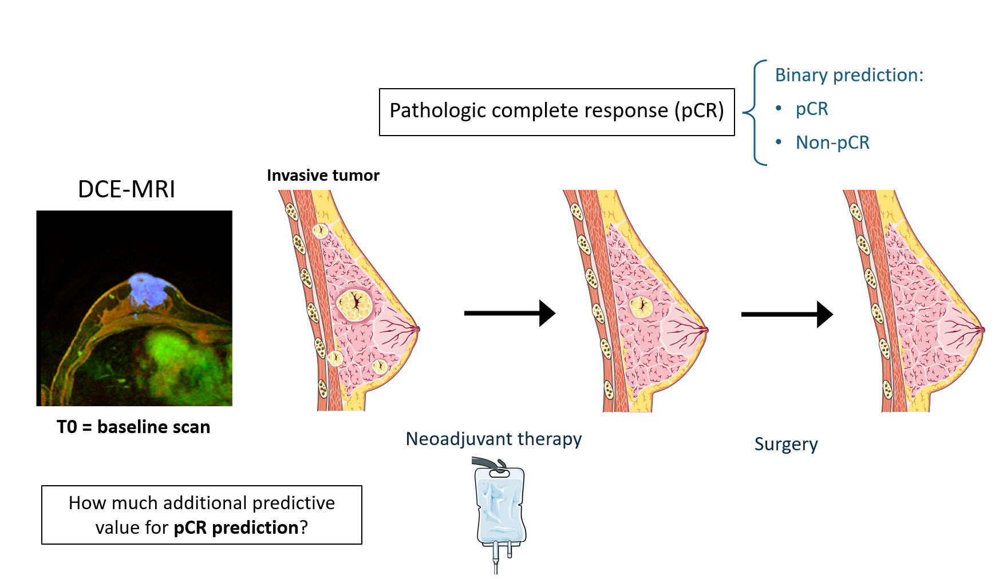
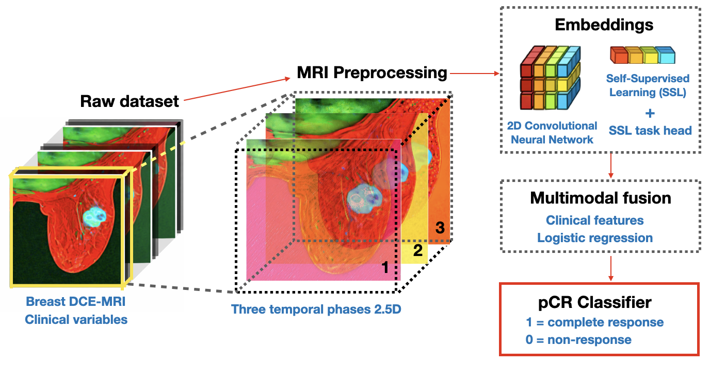
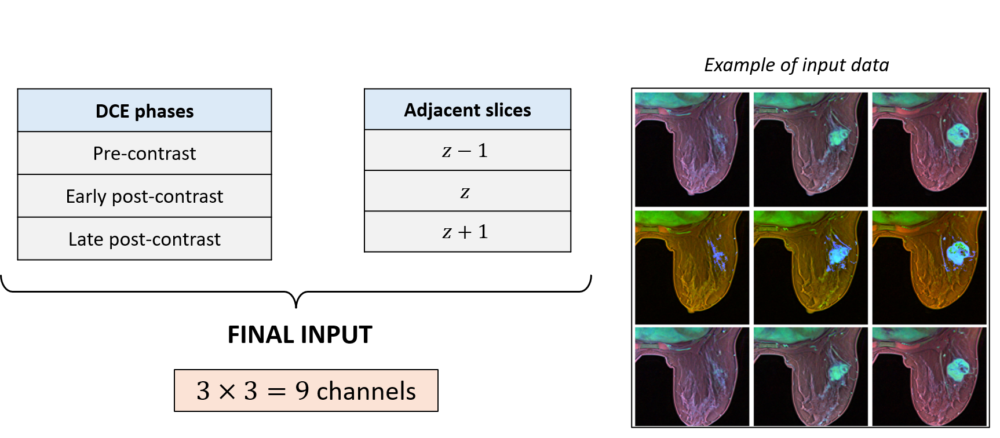
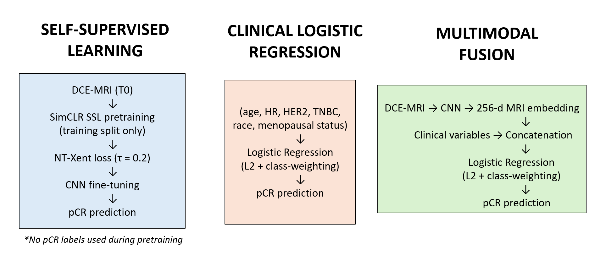
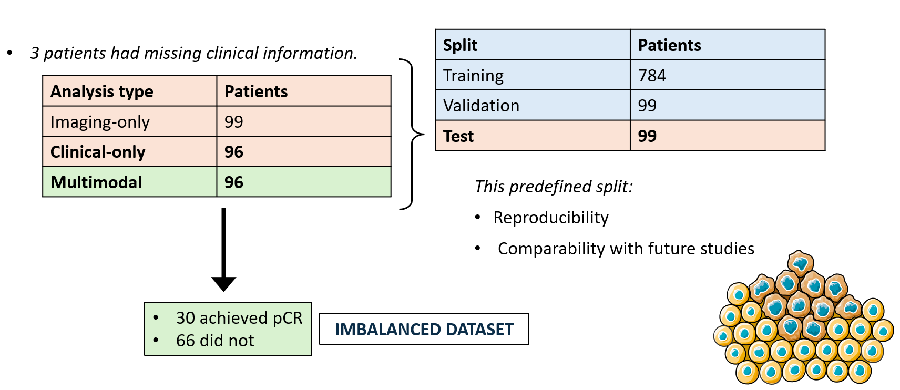

# ISPY2-Breast-MultimodalAI

**ISPY2-Breast-MultimodalAI** is a reproducible benchmark for **baseline prediction of pathologic complete response (pCR)** in breast cancer, integrating **dynamic contrast-enhanced MRI (DCE-MRI)** and **clinical variables** from the **I-SPY2 trial**.

The project focuses on the **clinically relevant pre-treatment scenario (baseline / T0)** and benchmarks **unimodal and multimodal learning approaches** under a consistent evaluation protocol.

---

## Motivation

Pathologic complete response (pCR) after neoadjuvant therapy is a strong prognostic marker in breast cancer. Accurate prediction of pCR at baseline could support treatment planning and patient stratification; however, predictive performance varies widely across imaging-only and multimodal approaches.

In practice, clinical variables often provide strong baseline performance, and it remains unclear how much additional value imaging-based deep learning models contribute when evaluated rigorously at the patient level.

Key question: How much additional predictive value does baseline DCE-MRI provide beyond established clinical features for pCR prediction?

<p align="center">

</p>

This repository provides:

- a **clean and reproducible benchmark** on I-SPY2,
- **standardized train/validation/test splits**,
- strong **unimodal baselines**, and
- a **transparent multimodal fusion strategy**.

---

## Task Definition

### Primary task
Binary classification of **pathologic complete response (pCR)**:

> *Given baseline (pre-treatment) data, will the patient achieve pCR after neoadjuvant therapy?*

### Inputs (baseline only)

- **Imaging**: Baseline DCE-MRI  
  - Pre-contrast  
  - Early post-contrast  
  - Late post-contrast  
- **Clinical variables**: Baseline clinicopathologic features (e.g., age, menopause status, HR/HER2 status, subtype indicators)

### Output
- pCR (responder vs non-responder)

Longitudinal imaging and post-treatment information are **not used**.

---

## Dataset

The experiments in this repository use the **BreastDCEDL-ISPY2** dataset, a standardized deep learning-ready dataset derived from the I-SPY2 clinical trial. It provides baseline DCE-MRI scans, tumor segmentations, harmonized clinical variables, and predefined train/validation/test splits for reproducible machine learning research.

### MRI Data

The imaging component includes:

- Baseline (T0) DCE-MRI scans
- Three contrast phases:
  - Pre-contrast
  - Early post-contrast
  - Late post-contrast
- Tumor segmentation masks
- Official train/validation/test splits

<p align="center">

</p>

### Clinical Data

Baseline clinicopathologic variables include:

- Age
- Menopause status
- Race
- HR status
- HER2 status
- Molecular subtype indicators
- Pathologic complete response (pCR)

### Data Access

The original MRI and clinical data are **not redistributed** with this repository.

They can be obtained from:

- **BreastDCEDL GitHub**  
  https://github.com/naomifridman/BreastDCEDL

- **The Cancer Imaging Archive (TCIA)**  
  https://www.cancerimagingarchive.net/analysis-result/breastdcedl_ispy2/

Users should follow the corresponding data access policies and cite the original dataset publications when using these data.

---

## MRI Representation (2.5D)

Each patient is represented using a **2.5D multi-phase strategy**:

- Central tumor slice determined using provided mask metadata
- Axial slices: \( z-1, z, z+1 \)
- Each slice contains 3 DCE phases

This results in a **9-channel input tensor** of shape:

(9, H, W)

<p align="center">

</p>

---

## Models

### Unimodal MRI (CNN)
- 2D convolutional neural network
- Four convolutional blocks with ReLU and max pooling
- Global average pooling
- Fully connected head producing a single logit
- Binary cross-entropy with logits loss
- Early stopping based on validation AUROC

### Clinical-only baseline
- Logistic regression
- Baseline clinical variables only
- Class imbalance handled via class weighting

### Multimodal model
- MRI CNN used as a **fixed feature extractor**
- 256-dimensional MRI embedding extracted after global average pooling
- MRI embedding concatenated with clinical features
- Logistic regression trained on fused features

<p align="center">

</p>
---

## Training and Evaluation

- Optimizer: Adam (CNN)
- Learning rate: \(1 \times 10^{-4}\)
- Batch size: 8
- Early stopping:
  - patience = 5
  - monitored on validation AUROC
- Learning rate scheduling: ReduceLROnPlateau

### Evaluation
- Metric: **AUROC**
- Evaluation performed at the **patient level**
- Final results reported on the held-out test set

<p align="center">

</p>
---

## Results (Test AUROC)

| Model                          | AUROC |
|--------------------------------|-------|
| MRI-only (CNN)                 | 0.559 |
| Clinical-only (Logistic Reg.)  | 0.725 |
| Multimodal (MRI + Clinical)    | 0.726 |

---

## Repository Structure
```text
ISPY2-Breast-MultimodalAI/
│
├── A1_mri_cnn.ipynb          # Trains and evaluates the supervised MRI-only CNN baseline.
├── A2_clinical_lr.ipynb      # Benchmarks classical machine learning models using clinical variables.
├── B1_multimodal.ipynb       # Feature-level multimodal fusion (MRI embeddings + clinical features).
├── B2_multimodal.ipynb       # Decision-level fusion combining MRI and clinical model predictions.
│
├── dataloader.py             # PyTorch data loading utilities for training, validation, and testing.
├── encoder.py                # CNN encoder and SimCLR self-supervised learning components.
├── ionifti.py                # Utilities for loading and processing NIfTI MRI volumes.
├── mri_cnn_model.py          # Definition of the supervised 2.5D CNN architecture for pCR prediction.
├── mri_dataset.py            # Dataset class for constructing 9-channel MRI inputs from DCE-MRI.
├── transformations.py        # MRI preprocessing and data augmentation pipeline.
│
├── README.md                 # Project overview, methodology, and reproducibility instructions.
├── LICENSE                   # License information.
└── .gitignore                # Files and directories excluded from version control.
```

---

## Reproducibility

All experiments were run using fixed data splits and deterministic preprocessing.  
Raw imaging and clinical data are **not redistributed** due to data usage agreements.

This repository provides scripts and notebooks required to reproduce all reported results from the original data sources.

---
## References

1. Fridman N, Solway B, Fridman T, Barnea I, Goldstein A.
   **BreastDCEDL: A standardized deep learning-ready breast DCE-MRI dataset of 2,070 patients.**
   Scientific Data (2026).
   https://doi.org/10.1038/s41597-026-06589-6

2. Fridman N, Goldstein A.
   **Curated, Segmented, and Deep Learning-Optimized I-SPY2 MRI Dataset for Prediction of pCR, HR, and HER2 Status (BreastDCEDL-ISPY2).**
   The Cancer Imaging Archive (TCIA), 2025.
   https://doi.org/10.7937/42WQ-TH78

## License and Disclaimer

This repository is provided for research and educational purposes only.  
The authors are not responsible for clinical use or interpretation of the results.
